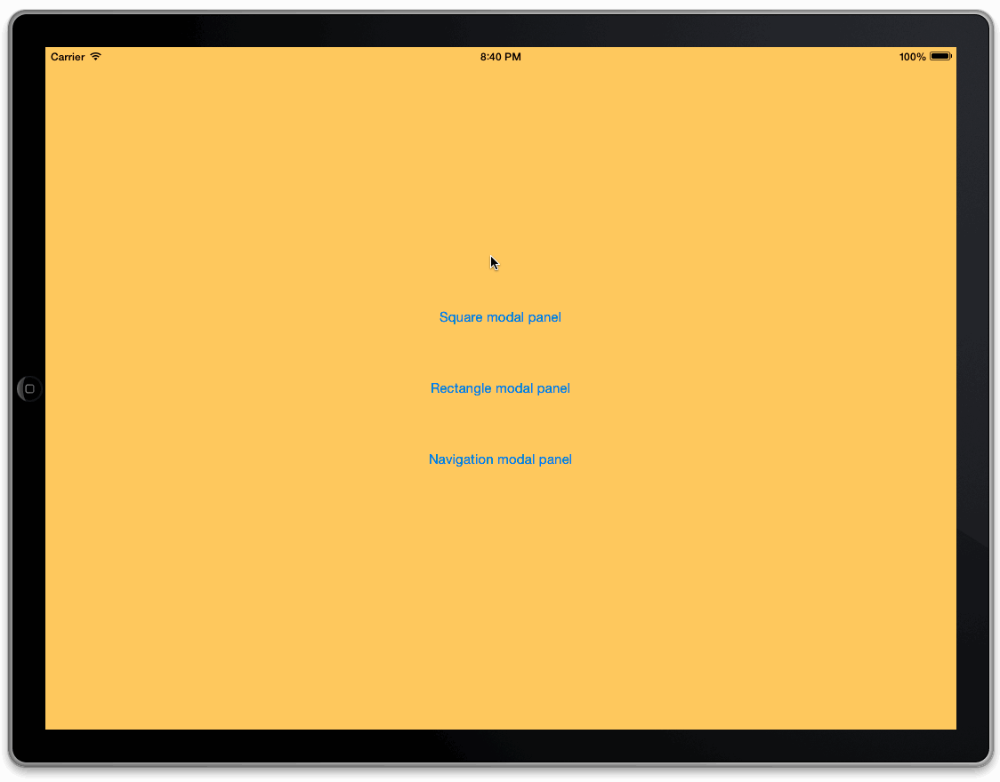
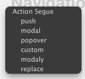
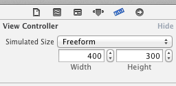
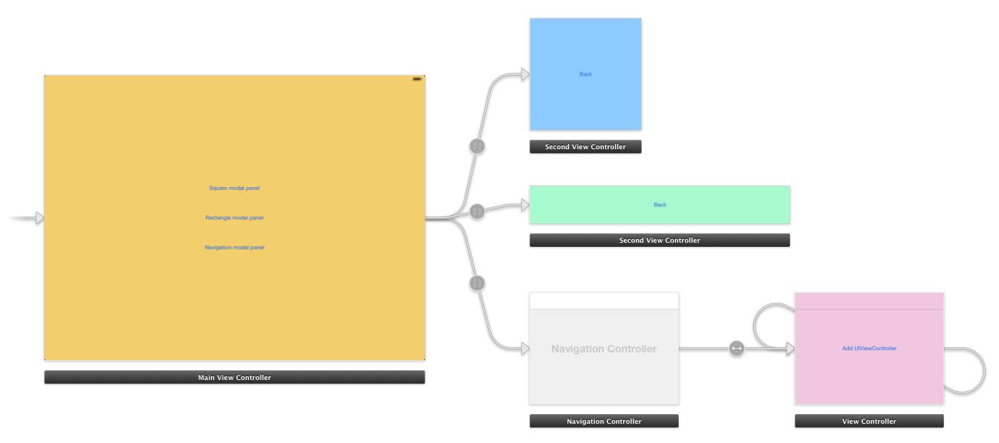

Display modal view controllers is easy if you want to follow Apple guidelines and default sizes, but if you need more than Form Sheet, Page Sheet or full screen, `Modaly` will help you, and all from storyboard, defining size of view controller as you like!



## Install

`Modaly` is available via CocoaPods, so you only need to include this line in your Podfile

```
pod 'Modaly'
```

## Use

You only need to select a button in your storyboard, and drag holding rigth button pressed to another view controller. When action segue dialog appears (image below), select `modaly`.



After that, you need to select `freeform`in view controller metrics menu (image below), and that's all!



`Modaly` supports common UIViewControllers and UINavigationControllers, and the best way to discover it is download and open `Demo` XCode project:




### Segue reference

To facilitate segue use, I use segue itself as `UIViewControllerTransitioningDelegate`, so it's important to save reference to segue because it could be release on display, and animation would call to a dealloc object.
It's easy to do that on `-prepareForSegue:sender:` method:

```obj-c
- (void)prepareForSegue:(UIStoryboardSegue *)segue sender:(id)sender {
    if ([segue isKindOfClass:[JMGModaly class]]) {
        // It needs to retain segue because it's animation transition delegate
        self.modalSegue = (JMGModaly *)segue;
    }
}
```
One more time, I recommend you to open demo project to see that easily.


## Acknowledges
- You can see a [list of contributors to this repo](https://github.com/patoroco/Modaly/graphs/contributors). Thanks to everybody!
- Special thanks to [Pedro Piñera](http://twitter.com/pepibumur) and [Luis Ascorbe](https://twitter.com/lascorbe) for support me with first approach to Modaly.
- I found very useful the [ultrajoke post](http://blog.spacemanlabs.com/2013/11/custom-view-controller-transitions-in-landscape/) about custom view controller transitions in landscape.

## Author
- Jorge Maroto ([@patoroco](http://twitter.com/patoroco)).

## License
`Modaly` is available under the MIT license. See the [LICENSE file](LICENSE.md) for more info.